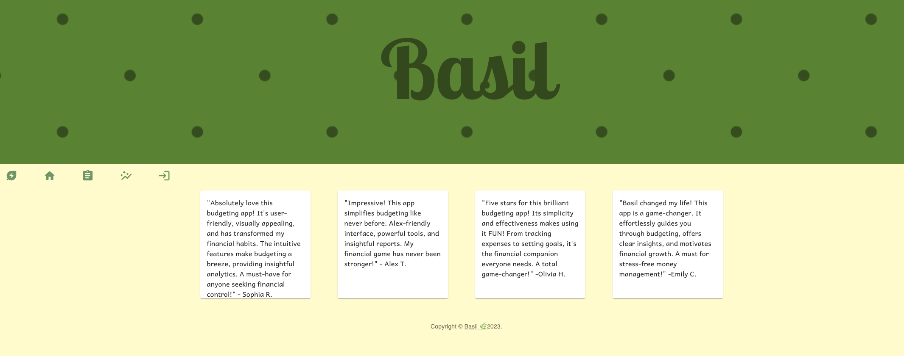

 # 🌿 Basil 🌿
 
## A Full Stack Budget Tracker with a robust functionality for signed-in users including adding trasactions, deleting trasactions, showing income and expense history lists, showing expense by category on different graphs.

## Table of Contents
- [Installation](#installation)
- [Techonolgy](#techonolgy)
- [Demo](#demo)
- [License](#license)
- [Questions](#questions)

## Installation
### To view deployed application 

### To view project code
1) Clone code repository  
```
git clone git@github.com:lizfischstix/Basil.git
```
2) Install dependencies  
```
open terminal on root directory
enter command:
npm install
```
3) Run servers
```
in same root directory terminal
enter command:
npm run develop
```

## Techonolgy
Back-end <br>
  

Front-end <br>
 

Database <br>


## Demo
Please find more through [CLICK ME !](https://basil-budget-e685e272efd5.herokuapp.com/)

Please use below info for fun :
```
 email: “maggie@email.com”,
 “password”: “pass1234",
```


## License
[](https://opensource.org/licenses/MIT) License used for this project - MIT 


## Questions
If you have any questions, please contact us : <br>
email:  👩 ingridmidia@gmail.com   👩 liz.devlin85@gmail.com   👩 chartwell99@gmail.com  👩  tanfei0704@gmail.com 